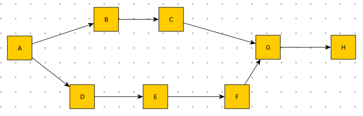

# redbreast 介绍

## 基本概念

redbreast一个简化的工作流引擎，我们先在这里介绍一些概念，或者说需要创建出来的程序对象。

所谓工作流，就是比如下面这样的一个有向图。



整个有向图，我们称之为工作流(Workflow)，图中每个结点，我们称之为任务(Task)。

有如下一些名称：

* _工作流定义 (WorkflowSpec)_
`redbreast.core.spec.WorkflowSpec`
工作流定义，简单而言就是定义一组任务，描述每个任务之间的有向连线关系。在运行中，指导工作流实例对象了解如何在每个任务之间跳转。

同一个工作流定义对象，在运行态只会有一份拷贝，它的逻辑与定义也是相对稳定的。
redbreast中通过spec文本文件方式来定义。基于uliweb app方式使用时，可以同步到数据库存中。

一个工作流一般有一个启动结点（没有输入流向），可以有多个结束结点（没有输出流向）。

* _任务定义(TaskSpec)_
`redbreast.core.sepc.TaskSpec`
任务定义，就是工作流定义中，流程上的一个结点。我们需要根据任务之间的连线关系和逻辑需要，选择不同的任务类型。

目前redbreast支持下面几种任务结点：
 - SimpleTask 简单结点，一进一出
 - SplitTask 分支汇出结点，一进多出，所有分支并行流出
 - ChoiceTask 选择结点，一进多出，只有一个分支流出
 - MultiChoiceTask 多选择汇出结点，一进多出，一到多个分支流出
 - JoinTask 汇入结点，配合SplitTask, MultiChoiceTask使用，多流出进行任务合并。

任务的定义，基本采用spec文本文件方式。同时，我们也可以通过继承上述的基类，使用python来撰写复杂逻辑。

* _工作流实例(Workflow)_
`redbreast.core.Workflow`
运行态中，根据工作流定义生成的实例对象。该实例对象中包含Task实例的树型列表，用来标记工作流_走过_的所有任务结点。
每一个具体的工作流都会形成一个不同的实例对象。有如下几种状态：
 - CREATED , 新建立
 - RUNNING , 活动中
 - FINISHED, 已完成

当在uliweb app中使用时，会同步形成数据库记录。支持状态保存。

* _任务实例(Task)_
`redbreast.core.Task`
运行态中，根据工作流任务定义，生成的实例对象，实例对象有下面几种状态：
 - ACTIVE，活动中
 - READY ，流转中
 - EXECUTING, 执行中
 - EXECUTED , 已执行
 - COMPLETED, 已完成

状态转换逻辑如下：
 - ACTIVE --> ready()  --> READY
 - READY --> execute()
   + [async] --> EXECUTING
   + [sync ] --> EXECUTED
 - EXECUTED --> transfer() --> COMPLETED

当在uliweb app中使用时，会同步形成数据库记录。支持状态保存。


## 安装
  
    git clone https://github.com/Longwosion/uliweb-redbreast.git
    cd uliweb-redbreast
    python setup.py install

## 独立使用

```
    from redbreast.core.spec import CoreWFManager
    from redbreast.core import Task, Workflow
    
    #...定义外部的Workflow.spec文件
    workflow_spec = CoreWFManager.get_workflow_spec('Workflow')
    
    #生成工作流实例，状态CREATED
    workflow = Workflow(workflow_spec)
    
    #启动工作流，状态为RUNNING，
    #   会创建第一个任务结点实例
    workflow.start()

    #流转中，非干预的流程，工作流状态会变成：FINISHED
    workflow.run()

```

注意，目前独立使用时候，不支持工作流序列化到数据库。

spec文件格式，参见文档 spec.md
更多内容，参见文档 guide.md


## Uliweb中使用

redbreast包，目前包括了五个app：

* `redbreast.core`
  - 工作流核心代码
  - 作为uliweb app使用时，支持spec保存到数据库
  - 提供uliweb命令 clearspec, syncspec, reloadspec

* `redbreast.middleware`
  - 提供对工作流实例对象的序列化支持
  - 支持通过uliweb settings方式，配置spec的事件响应

* `redbreast.moniter`
  - 提供一个简单基于plugs的流程监控页面，缺省超级用户可用。

* `redbreast.ui`
  - ui相关代码，目前只提供一个显示流转意见的模板页。

* `redbreast.daemon`
  - 提供几个uliweb命令: daemon, daemon-client。用来创建后台跑批运行工作流的守护。

### 配置 

在settings中增加:

    INSTALLED_APPS = [
        #------ redbreast -----------------------
        'redbreast.core',
        'redbreast.middleware',
        'redbreast.ui',
        'redbreast.daemon',
        'redbreast.moniter',
    ]

更多内容，参见文档 uliweb_app_guide.md


